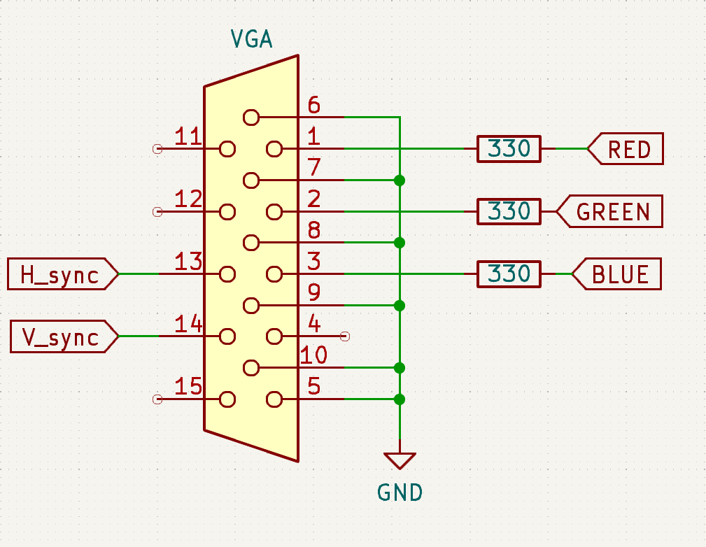

# Snake FPGA
W poniższym repozytorium znajdują się pliki `HDL` niezbędne do zbudowania projektu *Snake*. Projekt został zbudowany na płytce *Mimas Spartan 6*. Oraz z ręcznie zlutowanym złączem VGA.

Poniżej przedstawiono schemat połączenia złącza VGA:
